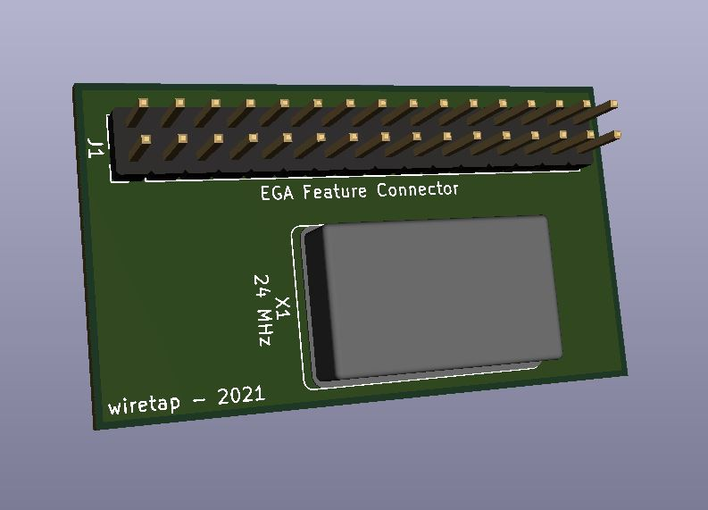
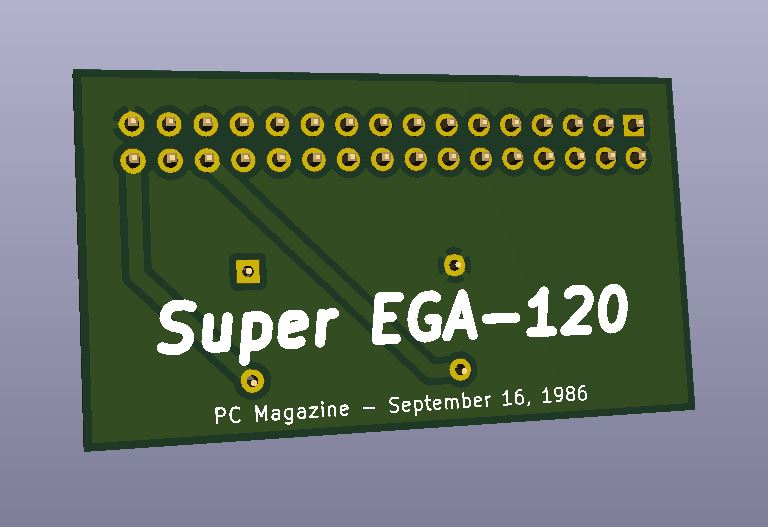

# Super EGA 120
A project from PC Magazine (September 16, 1986) to enable older EGA video cards to use 120 column mode.

\
\

## Info
A while back I bought a scrap lot containing a small PCB with a crystal oscillator attached to an EGA video card. I did a little research to figure out what it was, and came across the September 16, 1986 issue of PC Magazine describing how to build the same type PCB. It enables older EGA video cards to use 120 column mode. Some more modern video cards also allow selecting between the internal or an external oscillator by moving the jumper. Review your video card manual beforehand.
\
\
Included in this repository are the PCB gerber files, BOM, PC Magazine snippet of the project, and the corresponding PC Magazine software examples.

## Assembly / Installation
* Order the board from the PCB fabricator of your choice. (JLCPCB, PCBway, OSH Park, etc.)
* Order the pin header strip and full can crystal oscillator.
* Solder the crystal osciallator first, then the pin header.
* Install to the feature port of your EGA card.
* Copy the software files from the zipped archive to your retro PC.
* Follow the instructions in the PC magazine article.

## Notes
Requires a compatible monitor for 120 column mode, and an era appropriate EGA video card.

## Other
All schematics and software are from PC Magazine September 16, 1986. It appears this was designed to be an end-user project. Many companies used these same schematics to market their own EGA feature boards for 120+ column mode. For example, I also own a KEA EGAmate-132 that provides for 132-column mode. I have also included a clone of that adapter in this repository.
